<p align="center">
  
  &nbsp;&nbsp;&nbsp;&nbsp;&nbsp;
  
</p>

<h2 align="center">🏛️ INSTITUTO POLITÉCNICO NACIONAL</h2>
<h3 align="center">💻 ESCUELA SUPERIOR DE CÓMPUTO</h3>
<p align="center"><b>Ingeniería en Sistemas Computacionales</b></p>

---

<p align="center">

**👨‍🏫 Profesor:** Gabriel Hurtado Avilés

**👨‍🎓 Alumno:** Ricardo Carmona Martínez

**👥 Grupo:** 7CV4

**📅 Fecha de entrega:** 06 de marzo de 2026

</p>

---

<h1 align="center">📱 Tarea 3 - Backend de la Práctica 2</h1>


---

# 📖 Descripción del Proyecto

Este proyecto consiste en el desarrollo e integración de un **Backend RESTful dockerizado** y una **aplicación cliente Android nativa**. Cumple y expande los objetivos de la práctica al implementar e integrar un panel de administración casi completo para usuarios.

El flujo de comunicación abarca:

`Android App (Jetpack Compose) → HTTP Request (Retrofit) → Flask API → SQLite → JSON Response → App`

---

# 📂 Estructura del Proyecto

El repositorio está dividido lógicamente para separar el frontend del backend:

```
TAREA3-FLASK-ANDROID/
├── Android/
│   └── FlaskLogin/              # Proyecto raíz de Android Studio
│       ├── app/                 # Código fuente Kotlin y Jetpack Compose
│       ├── build.gradle.kts     # Configuración de dependencias (Retrofit, etc.)
│       └── ...
├── Docker-Flask/
│   └── ORM/                     # Backend API
│       ├── instance/            # Base de datos SQLite (generada automáticamente)
│       ├── app.py               # Lógica del servidor y endpoints REST
│       ├── docker-compose.yml   # Orquestación del contenedor
│       ├── Dockerfile           # Imagen del sistema Python
│       └── requirements.txt     # Dependencias (Flask, SQLAlchemy, Bcrypt)
└── README.md
```

---

# 🧱 Arquitectura y Tecnologías

## ⚙️ Backend (API REST)

* **Lenguaje:** Python 3.9
* **Framework:** Flask
* **ORM & Base de Datos:** Flask-SQLAlchemy + SQLite
* **Seguridad:** Flask-Bcrypt (Hashing de contraseñas)
* **Despliegue:** Docker y Docker Compose

## 📱 Frontend (Android)

* **Lenguaje:** Kotlin
* **UI:** Jetpack Compose (Material Design 3)
* **Navegación:** Navigation-compose (Type-safe routing)
* **Networking:** Retrofit 2 + Gson
* **Concurrencia:** Kotlin Coroutines
* **Arquitectura de Red:** Utilería centralizada (`ErrorUtils`) para captura de excepciones.

---

# 🌐 Endpoints Implementados (API REST)

El backend expone las siguientes rutas, superando los requerimientos iniciales de la práctica:

| Método   | Endpoint               | Descripción                                               |
| -------- | ---------------------- | --------------------------------------------------------- |
| `GET`    | `/`                    | Health Check. Verifica que la API si funciona.            |
| `POST`   | `/register`            | Registra un nuevo usuario validando campos y contraseñas. |
| `POST`   | `/login`               | Autentica un usuario existente mediante Bcrypt.           |
| `GET`    | `/users`               | *(Extra)* Obtiene la lista de todos los usuarios.         |
| `PUT`    | `/users/<id>/username` | *(Extra)* Modifica el nombre de un usuario específico.    |
| `PUT`    | `/users/<id>/password` | *(Extra)* Cambia la contraseña (requiere la actual).      |
| `DELETE` | `/users/<id>`          | *(Extra)* Elimina un usuario de la base de datos.         |

---

# 🚀 Instrucciones de Despliegue y Ejecución

Para probar el flujo completo, es fundamental levantar primero el servidor Docker y posteriormente ejecutar el cliente Android.

## 1️⃣ Levantar el Backend (Docker)

1. Abre una terminal y navega hasta el directorio del backend:

```
cd Docker-Flask/ORM
```

2. Ejecuta el comando para construir y levantar el contenedor:

```
docker compose up --build
```

3. El servidor estará escuchando en:

```
http://localhost:5000
```

*Nota: Para detener el servidor utiliza `docker compose down`.*

---

## 2️⃣ Ejecutar la Aplicación Android

1. Abre **Android Studio**.
2. Selecciona **Open Project** y navega hasta la carpeta:

```
TAREA3-FLASK-ANDROID/Android/FlaskLogin
```

⚠️ Importante: abre **FlaskLogin**, no la carpeta **Android**.

3. Espera a que **Gradle sincronice** las dependencias del proyecto.
4. Inicia un **emulador (AVD)** con API 24 o superior.

La app está configurada para conectarse al backend usando:

```
http://10.0.2.2:5000
```

5. Presiona **Run ▶** o utiliza:

```
Shift + F10
```

---

# 🧩 Estructura de la Aplicación Android (Pantallas)

La interfaz de usuario ha sido desarrollada íntegramente con **Jetpack Compose**, aplicando un enfoque reactivo y moderno para la gestión de estados.

* **Pantalla de Login:** Implementa un `LaunchedEffect` con una corrutina que realiza **polling asíncrono** cada 5 segundos al endpoint `/`. Esto permite verificar en tiempo real si el servidor está activo, actualizando la UI dinámicamente según la disponibilidad del backend.
* **Pantalla de Registro:** Incluye lógica de validación en el lado del cliente (Frontend). El sistema verifica que los campos no estén vacíos y que ambas contraseñas coincidan antes de disparar la petición de red, optimizando así el uso de la API.
* **Pantalla de Bienvenida:** Utiliza el sistema de **Type-safe routing** de *Compose Navigation* para la transferencia de datos entre pantallas, recibiendo y mostrando el nombre del usuario autenticado de forma segura.
* **Gestión de Usuarios (Panel CRUD):** Implementa un componente `LazyColumn` interactivo para el manejo eficiente de listas extensas. Permite la administración total de las cuentas mediante:
    * **Edición de nombres:** Peticiones de tipo `PUT`.
    * **Actualización de seguridad:** Cambio de contraseñas mediante `PUT`.
    * **Eliminación de registros:** Operaciones `DELETE` con actualización inmediata del estado de la lista.
---

# 🛡️Manejo de Errores

El sistema está diseñado para evitar cierres inesperados ante fallos de red cpmo es indicado en las intrucciones de la tarea

Si el contenedor Docker se detiene:

1. El interceptor `ErrorUtils` de Retrofit captura la `ConnectException`.
2. La UI de Compose detecta el cambio de estado.
3. Se muestra el mensaje:

```
"No se pudo conectar al servidor"
```

---

# 📸 Orden de Capturas de Pantalla (Entregables)


<div align="center">

### 1. API funcionando — `curl http://localhost:5000/`
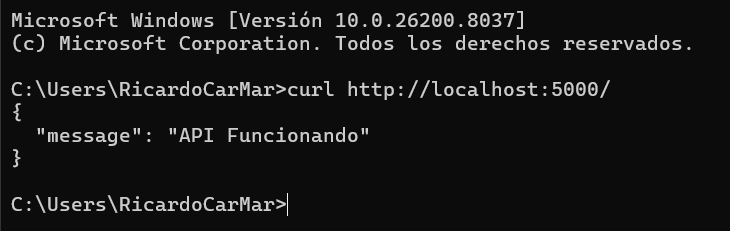
<br>
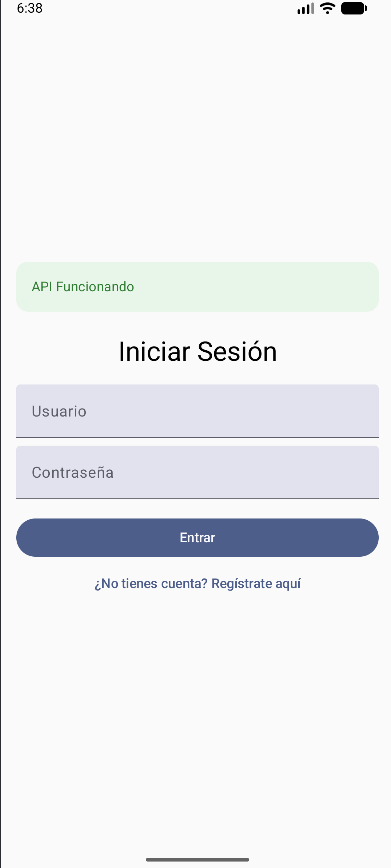

---

### 2. Registro exitoso — creación de usuario
<p>
  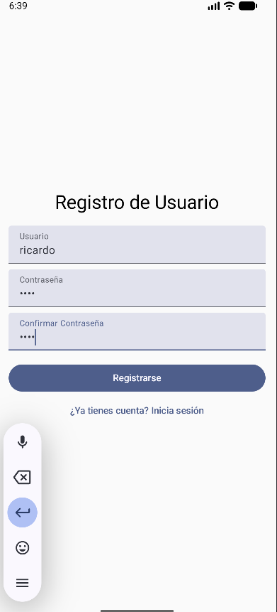
  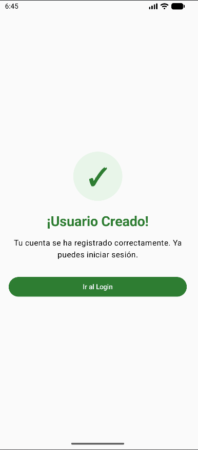
</p>

---

### 3. Usuario duplicado — error al registrar existente
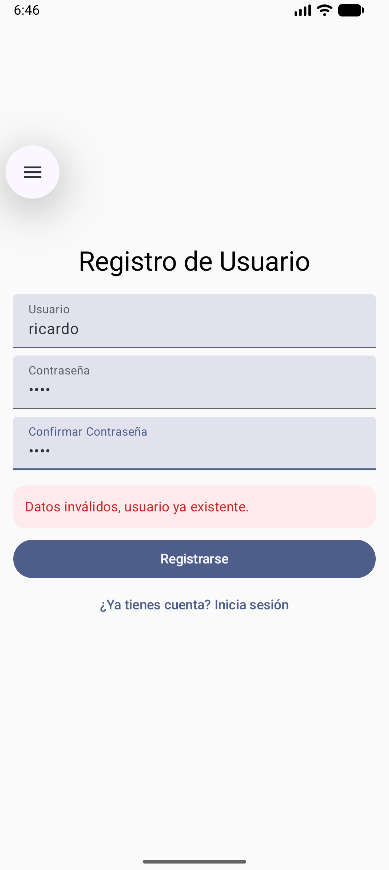

---

### 4. Login exitoso — acceso correcto
<p>
  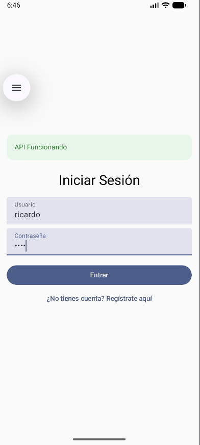
  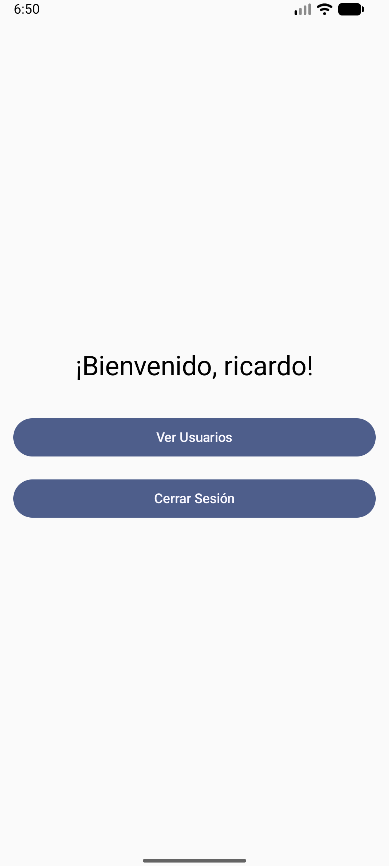
</p>

---

### 5. Login incorrecto — credenciales inválidas
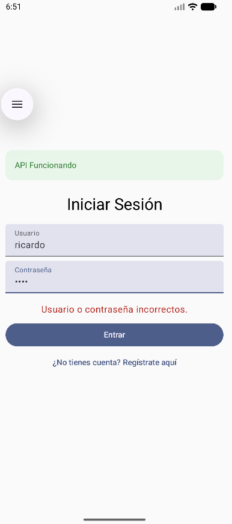

---

### 6. Error de red — Docker apagado
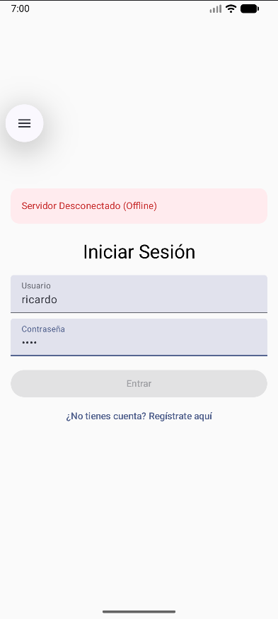

---

### 7. Lista de usuarios (Extra)
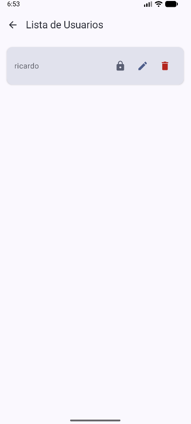

---

### 8. Editar username (Extra)
<p>
  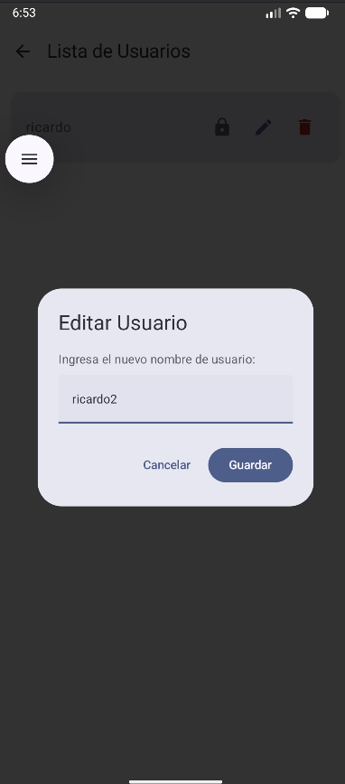
  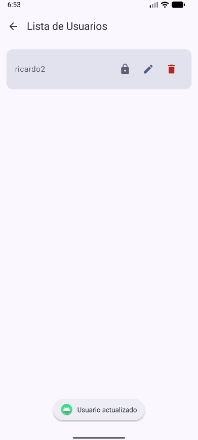
</p>

---

### 9. Cambiar contraseña (Extra)
<p>
  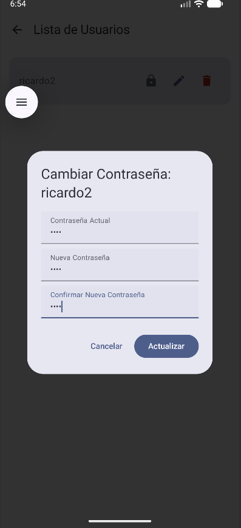
  
</p>

---

### 10. Eliminar usuario (Extra)
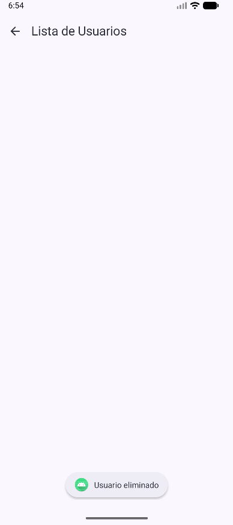

</div>


---

# 🧑‍💻 Autor

**Ricardo Carmona Martínez**
Estudiante de Ingeniería en Sistemas Computacionales

Escuela Superior de Cómputo — IPN
